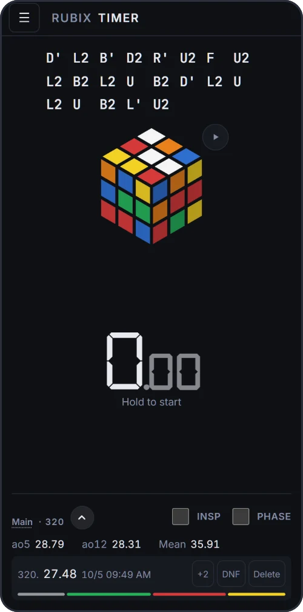
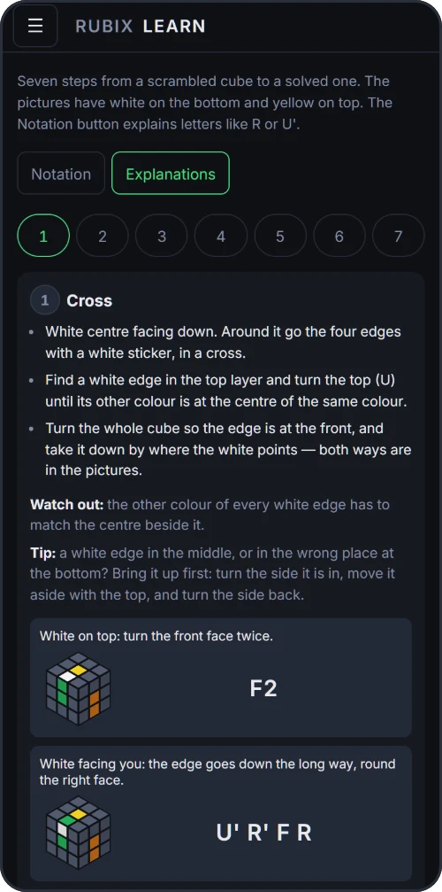
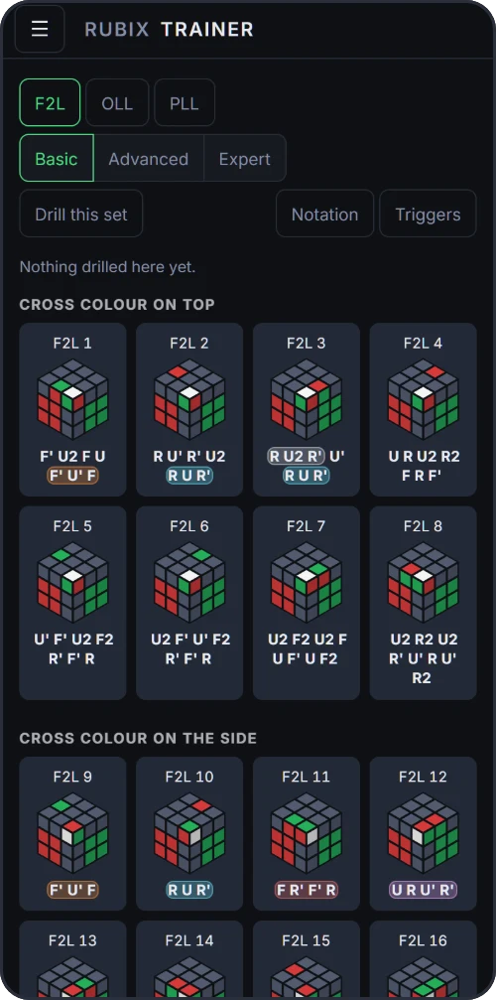
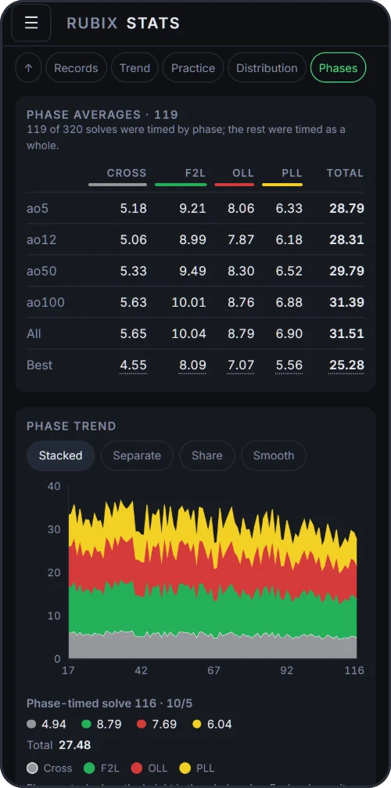

# Rubix

An offline speedcubing trainer for the 3×3, from a first solve to a fast average.
It runs in the browser and installs as an app on a phone or a computer:
**[rubix.lahvi.cz](https://rubix.lahvi.cz)**

Free, no account, no ads. Once opened, it works without a connection. English and Czech.

<p align="center">
  
  
  
  
</p>

## What it does

### Timer
- Hold to start (space bar or anywhere on the screen), tap anything to stop.
- WCA inspection with a countdown bar and beeps at 8 and 12 seconds; going over
  gives the +2 or DNF on its own.
- Random-state WCA scrambles generated on the device, with a flat or 3D preview
  of the scrambled cube. Paste your own scramble to practise a particular situation.
- While the clock runs, only the time is on screen — and you choose whether it
  shows hundredths, tenths, whole seconds or nothing at all.
- Under your averages, what the next solve needs for a new best ao5 or ao12 —
  shown only while one is in reach, and it can be turned off.

### History and sessions
- Every solve with its scramble, penalty, tags, note and star; fix a mistyped
  time or a penalty later.
- Separate sessions for different practice, archived when you are done with them.
- Deleting a solve can be undone for a few seconds.

### Statistics
- Current and best ao5, ao12, ao50 and ao100, personal bests, mean, median,
  standard deviation, DNF and +2 rate.
- A histogram of times, and a trend of the rolling ao12 against the slower ao50.
- Averages follow the csTimer convention, so the numbers match what you are used to.

### Algorithm trainer
- PLL, OLL and F2L, plus 2-Look OLL and PLL for the way most people learn them.
- Every case drawn as a diagram with arrows for where the pieces go; play the
  algorithm on a 3D cube move by move.
- Alternative algorithms for a case, your own algorithms, and named triggers
  (sexy move, sledgehammer…) highlighted inside them.
- Drill a chosen set of cases against the clock and see which ones are your slowest.

### Phase splits
- Time cross, F2L, OLL and PLL separately by tapping as you finish each one.
- See your average and best time for every phase, how your current ao12 divides
  between them, and how they change over time.

### Beginner guide
- A whole first solve in seven steps, one algorithm each, with pictures of how
  to hold the cube.
- Can be hidden once you no longer need it.

### Sharing
- Send a solve or an average as a picture.
- Send a link with the same scrambles, so a friend can try to beat your time
  or your ao5.

### Your data
- Back up everything to a single file and restore it, or merge it into another
  device; you see what will change before anything does.
- Import your history from csTimer.
- Export solves to CSV for a spreadsheet.

### Look
- Light and dark theme, cube colour schemes, text and clock size, a choice of fonts.

## Privacy

There are no accounts and no backend. Everything you record stays in your browser's
storage and leaves the device only when you export it yourself. The one outside
request is Cloudflare Web Analytics, which counts page views; it knows nothing
about your solves and nothing waits for it.

## Bugs and ideas

[Open an issue](https://github.com/lahvi13/rubix/issues/new/choose) — or, without a
GitHub account, write to the e-mail on the app's About screen. More in
[CONTRIBUTING.md](CONTRIBUTING.md).

## Running it

Node 24 (see `.node-version`).

```sh
npm install
npm run dev       # development server, no service worker
npm test
npm run build && npm run preview   # the real PWA, with offline caching
```

A push to `main` builds and deploys to Cloudflare Workers as static assets.

## How it is made

Rubix is my project. The idea, what goes in and what stays out, how every
screen behaves and looks — those are my decisions, and I try the changes
with a cube in my hands on real devices.

I write the code together with [Claude Code](https://claude.com/claude-code),
Anthropic's AI coding assistant; the commits it worked on say so in their
`Co-Authored-By` line.

Built with Vite, React and TypeScript, Dexie over IndexedDB,
[cubing.js](https://js.cubing.net/cubing/) for scrambles and 3D playback and
Recharts for charts. The specification ([SPEC.md](SPEC.md)) and the project
conventions ([CLAUDE.md](CLAUDE.md)) are in Czech; the code, comments and commit
messages are in English.

## License

[GPL-3.0-or-later](LICENSE). You may use, change and share Rubix; a changed version
you distribute has to stay open under the same license.
